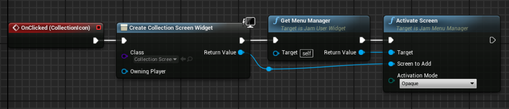
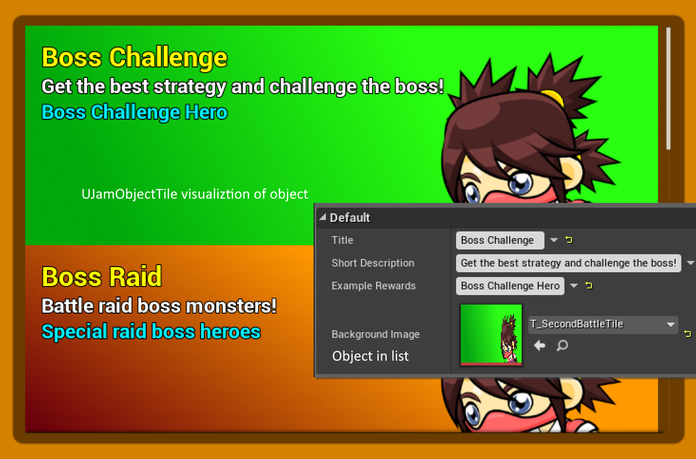
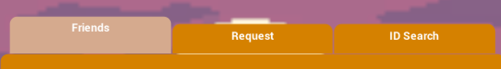

# SharedJamUI plugin for UE4

This plugin implements some useful base widgets and a simple menu manager to create game user interfaces in **Unreal Engine 4**.

## Quick Start

It's easy to get up and running:

* Download the SharedJamUI plugin source from this page (click **Clone or download** -> **Download ZIP**).

* Unzip the files into a new **SharedJamUI** sub-folder under your project's **Plugins** folder.  It should end up looking like *"/MyProject/Plugins/SharedJamUI/<files>"*

* **Rebuild** your C++ project.  The new plugin will be compiled too!

* Load the editor.

* Create a class derived from AJamMenuManager (or reparent your existing HUD class to derive from it)

* Set this new class as the HUD class in your Game Mode class

* Now you can create new screens by deriving from UJamScreenBase, and display them by calling ActivateScreen on the menu manager

If the rebuild was successful but you don't see the new features, double check that the **Shared Jam UI** plugin is enabled by clicking the **Settings** toolbar button, then click **Plugins**.  Locate the **Shared Jam UI** plugin and make sure **Enabled** is checked.

If you're new to plugins in UE4, you can find lots of information [right here](https://wiki.unrealengine.com/An_Introduction_to_UE4_Plugins).

## Plugin Details

### Interesting Classes

*UJamScreenBase* is the parent class for any screen in the UI. Only one screen can be active at once; when a new screen is activated, older screens will be rendered inactive according to the ActivationMode of the new screen (Transparent will set them to HitTestInvisible, Opaque will set them to Collapsed, and Exclusive will destroy them). When a screen is popped, the screen underneath it will be restored to Visible.  Screens get events for being pushed onto the menu stack or popped from it, and events when uncovered or obscured by other menus, so they can further customize this behavior (e.g., animating in or out).

*UJamUserWidget* is the base class for other widgets in the library and can be used as the base class for your widgets as well. It provides easy access to the menu manager (GetMenuManager) and exposes a PreConstruct() method that is called *in the designer* as well as at runtime.  This can be used to make generic widget building blocks like buttons display as desired in the designer, but must be used with caution. The game isn't running in the designer, so accessing the player controller or game instance will fail. A good rule of thumb is to only access member properties of the widget during PreConstruct.

*UJamObjectList* and *UJamObjectTile* work together to create tile views for lists of objects or classes. Derive from UJamObjectList and add a panel widget (e.g., a vertical box) named TileContainer.  Place this derived type in another blueprint and set DefaultTileType to a visualizer class derived from UJamObjectTile, then set ObjectsToDisplay/ClassesToDisplay and call RebuildObjectMap. This will create an instance of your tile class for each object/class in the list, and that class can visualize the object however it sees fit.

*UJamTabStrip* and *UJamTabButton* work together to create a 'radio button' where at most one such button can be active at once (typically used for a tab strip that in turn controls the visibility of other widgets in a widget switcher panel). 

### Known Issues

This plugin should be considered 'jam-quality' code, it hasn't been battle tested in production.

* Menus are hard-referenced, so loading your top level menu will end up loading all submenus into memory as well.  This is bad both for memory usage and iteration time in the editor. Lazy-loading screens via asset references while displaying a progress widget will probably be added in the future.

* Code is under- or undocumented. Have a look at the test project to see how to use the plugin in practice.

### Compatibility

This plugin requires Visual Studio and either a C++ code project or the full Unreal Engine 4 source code from GitHub.  If you are new to programming in UE4, please see the official [Programming Guide](https://docs.unrealengine.com/latest/INT/Programming/index.html)! 

The plugin has only been tested on Windows with Visual Studio 2015 and the 4.14 release of UE4, although it should be portable to other platforms and future versions of UE4.

## Support

Note: This project is maintained in a private Perforce repository and mirrored to GitHub.

It should be considered 'jam-quality' code and hasn't been battle tested in production, so YMMV; however if any critical fixes are contributed, I'll certainly try to review and integrate them.  For bugs, please file an issue, submit a pull request or catch me [on Twitter](https://twitter.com/joatski).
